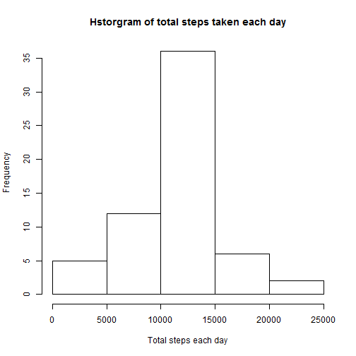

# Reproducible Research: Peer Assessment 1

## Introduction  
This assignment takes in the data file named activity.zip, extracts the csv data file from it.  
This extracted acticity.csv data file is then read and processed to answer the following questions.

## Loading and preprocessing the data
These are the steps involved in loading and preprocessing the data file.
* First, the activity.zip file is downloaded from the provided URL  
if the activity.zip file doesn't exist already
* Extracts the activity.csv data file from the activity.zip file
* Loads the data from activity.csv file using read.csv method
* pre-processes the data set to use Date values instead of String date

Here's the code in R to load and preprocess the data as described above:


```r
require("data.table")
```

```
## Loading required package: data.table
```

```r
if (!file.exists("activity.zip")) {
    download.file("https://d396qusza40orc.cloudfront.net/repdata%2Fdata%2Factivity.zip", 
                  destfile = "activity.zip")
    }
unzip("activity.zip")
completeActivityData <- read.csv ("activity.csv")
completeActivityData$date <- as.Date(completeActivityData$date, "%Y-%m-%d")
## Display the top 3 rows from this preprocessed data set
head(completeActivityData, 3)
```

```
##   steps       date interval
## 1    NA 2012-10-01        0
## 2    NA 2012-10-01        5
## 3    NA 2012-10-01       10
```

## What is mean total number of steps taken per day?
To answer the first part of the question, we first ignore the missing values. 

```r
activityData <- completeActivityData[!is.na(completeActivityData$steps),]
## Display the top 3 rows from this processed data set
head(activityData,3)
```

```
##     steps       date interval
## 289     0 2012-10-02        0
## 290     0 2012-10-02        5
## 291     0 2012-10-02       10
```

Then, we calculate the total number of steps taken each day for which the data is available.  
To do this, we use ddply function.

```r
require("plyr")
```

```
## Loading required package: plyr
```

```r
activityData <- ddply(activityData, c("date"), summarise, totalDaySteps=sum(steps))
## Display the top 3 rows from this processed data set
head(activityData,3)
```

```
##         date totalDaySteps
## 1 2012-10-02           126
## 2 2012-10-03         11352
## 3 2012-10-04         12116
```

Then, we plot the histogram displaying the total number of steps taken each day.

```r
hist(activityData$totalDaySteps,
     main="Hstorgram of total steps taken each day",
     xlab="Total steps each day")
```

 

Mean of total steps taken per day is: 10766  
Median of total steps taken per day is: 10765  

## What is the average daily activity pattern?
To answer the first part of the question, we first ignore the missing values. 

```r
activityData <- completeActivityData[!is.na(completeActivityData$steps),]
```

Then, we calculate the average number of steps taken for each time slot across all the day  
for which the data is available. To do this, we use ddply function.

```r
require("plyr")
activityData <- ddply(activityData, c("interval"), summarise, averageNumberOfSteps=mean(steps))
## Display the top 3 rows from this processed data set
head(activityData,3)
```

```
##   interval averageNumberOfSteps
## 1        0               1.7170
## 2        5               0.3396
## 3       10               0.1321
```

Then, we display the time series plot of the average number of steps for each  
time slot across all the day.

```r
require("ggplot2")
```

```
## Loading required package: ggplot2
```

```r
myplot <- qplot(interval, averageNumberOfSteps, data = activityData) + 
    geom_line() +
    labs(title=c("Time series plot of average steps taken across all days"),
         x="Time intervals",
         y="Average number of steps taken")
myplot
```

 

5-minute time interval: 835  
has the maximum number of steps of: 206.1698, on average across all days in the data set.

## Imputing missing values
There are a number of days/intervals where there are missing values (coded as NA).  
The presence of missing days may introduce bias into some calculations or summaries of the data.  

* The total number of missing values in the dataset is: 15264  
* We will fill in all of the missing values in the dataset with the mean for that 5-minute interval.  
* The new dataset that is equal to the original dataset but with the missing data filled in:

```r
activityData <- completeActivityData
activityData$avg <- ave(activityData$steps,activityData$interval,FUN=function(x) mean(x,na.rm=TRUE))
activityData$steps[is.na(activityData$steps)] <- activityData$avg[is.na(activityData$steps)]
```

If we calculate the total number of steps taken each day for the dataset with mean of that 5 minute  
time interval for which the values are missing using the ddply function:

```r
require("plyr")
activityData <- ddply(activityData, c("date"), summarise, totalDaySteps=sum(steps))
## Display the top 3 rows from this processed data set
head(activityData,3)
```

```
##         date totalDaySteps
## 1 2012-10-01         10766
## 2 2012-10-02           126
## 3 2012-10-03         11352
```

Now, we plot the histogram displaying the total number of steps taken each day.

```r
hist(activityData$totalDaySteps,
     main="Hstorgram of total steps taken each day",
     xlab="Total steps each day")
```

 

Mean of total steps taken per day after filling in the missing values with its mean is: 10766  
Median of total steps taken per day after filling in the missing values with its mean is: 10766  

Do these values differ from the estimates from the first part of the assignment?  
* Mean value stays the same as before when the mean was calculated without using the missing values  
compared to the mean calculated by filling in mean of 5-minute time interval for that missing values.
* Median value changed based on the number of missing values in the data. If the missing data values  
and current frequency of the mean values put to gether is greater than the frequency of the median  
value calculated without using median values, it would have stayed the same as before. Since the number  
of missing values increased the frequency of the mean values in the data after filling in the missing  
values, the new median is the same as the mean value.

What is the impact of imputing missing data on the estimates of the total daily number of steps?
* Even though the mean value is NOT impacted by imputing the missing data, median value changed  
to be the same as the mean value due to the number of missing values skewing the frequency of the  
mean values after imputing the missing data.

## Are there differences in activity patterns between weekdays and weekends?
To address this question, we do the following steps to process the data:  
* Take a copy of the original activity data
* Identify and label weekdays and weekends into a factor of 2 levels: "weekday", "weekend"
* Compute the average number of steps taken per interval across weekday and weekends using the  
ddply function, coputing the mean on the combination of interval and weekday factor level
* Plot the average number of steps taken per interval using factor weekday as the facet
* Display the computed plot


```r
require("plyr")
require("ggplot2")
activityData <- completeActivityData
#identify if the day is weekday or weekend
activityData$weekday <- c("Weekday")
activityData$weekday[weekdays(activityData$date, abbreviate=TRUE) %in% c("Sat","Sun")] <- c("Weekend")
#calculate the average number of steps for the interval across weekdays / weekends
activityData <- ddply(activityData, 
                      c("interval","weekday"), 
                      summarise, 
                      meanSteps=mean(steps, na.rm=TRUE))
#plot the data for weekday and weekend in different panels
myplot <- qplot(interval, meanSteps, data = activityData, col=weekday) + 
    facet_wrap( ~ weekday, ncol=1) +
    guides(colour=FALSE) +
    geom_line() +
    labs(title=c("Activity patterns between weekday and weekend"),
         x="Interval", y="Number of steps")
#display the plot
myplot
```

 

As can be seen from the plot, the subjects weekend activities starts earlier than that of his/her  
weekday and peaks between 9 and 10am. However, on weekdays the activies start later but stays high  
consistently across the day unlike the weekends where the activies go down after 10am and stays  
relatively lower compared to the subjects weekday activity pattern.  
